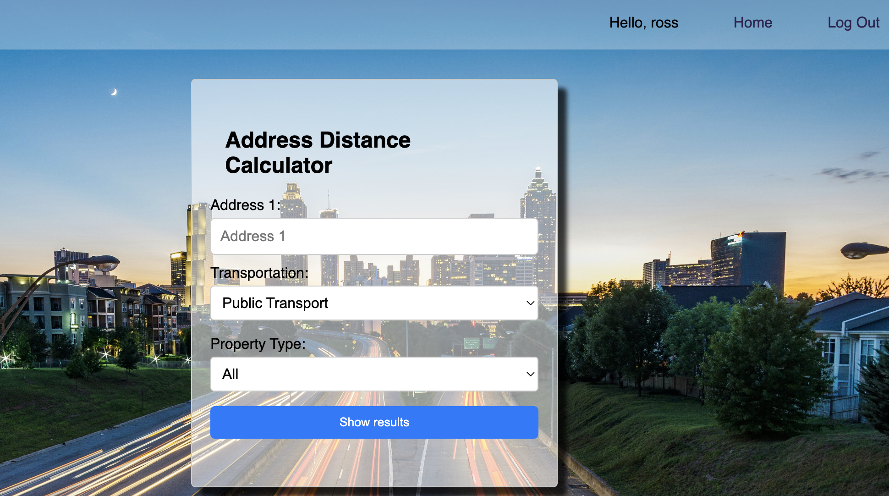
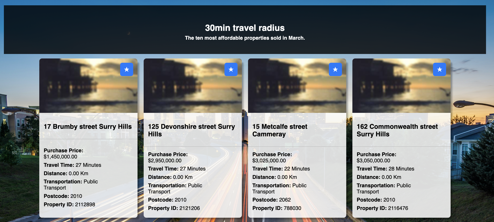

# Project3: Real Estate Price/Distance aggregator

* This app allows the user to input the location of a point of interest (e.g. place of work), it will then look up recent property sales, sort them by price and display them according to whether they are with 15 minutes, 30 minutes, 45 minutes and an hour's travel time from the user's place of interest.
* The user has the option of personalising their search by choosing their mode of transport and calulcates the travel time radius accordingly.
* The user also has the option of filtering results according to property type e.g. houses or apartments.
* This app attempts to: 
- Help the user identify which travel time radius' are affordable 
- Identify to the user which areas are affordable and within their travel time limit 

## Screenshots
### Home page
 
 

## Technologies used
* JavaScript
* HTML 
* CSS
* Express
* Google 0Auth

## Getting 
* App not yet deployed - start-up on computer in the meantime
* Login 
* Input place of interest
* Select mode of transport
* Select property type
* Review results

## Next steps
* Update styling 
* Identify the suburb with the lowest average price that is within each travel time radius
* Update property data to include Central Coast and wollongong areas

